## Deploy Containerized Application To AWS App Runner

This lab is provided as part of **[AWS Innovate Every Application Edition](https://aws.amazon.com/events/aws-innovate/apj/for-every-app/)**. 

ℹ️ You will run this lab in your own AWS account. Please follow directions at the end of the lab to remove resources to avoid future costs.

### About this lab

[AWS App Runner](https://aws.amazon.com/apprunner/) is a fully managed service that makes it easy for developers to quickly deploy containerized web applications and APIs, at scale and with no prior infrastructure experience required. Start with your source code or a container image. App Runner automatically builds and deploys the web application and load balances traffic with encryption. App Runner also scales up or down automatically to meet your traffic needs. With App Runner, rather than thinking about servers or scaling, you have more time to focus on your applications.


In this lab, we will build a container image which we will push to [Amazon Elastic Container Registry (ECR)](https://aws.amazon.com/ecr/), a fully managed container registry. The container image we have built will then be deployed to AWS App Runner.

## Setup

### Step 1 - Create Cloud9 environment via AWS CloudFormation

1. Log in your AWS Account
1. Click [this link](https://console.aws.amazon.com/cloudformation/home?region=us-west-2#/stacks/new?stackName=AWS-App-Runner&templateURL=https://awsinnovatefea2022.s3.amazonaws.com/aws-app-runner/cloud9.yaml) and open a new browser tab
1. Click *Next* again to the stack review page, tick **I acknowledge that AWS CloudFormation might create IAM resources** box and click *Create stack*.
  
  

4. Wait for a few minutes for stack creation to complete.
5. Select the stack and note down the outputs (*Cloud9EnvironmentId* & *InstanceProfile*) on *outputs* tab for next step.

  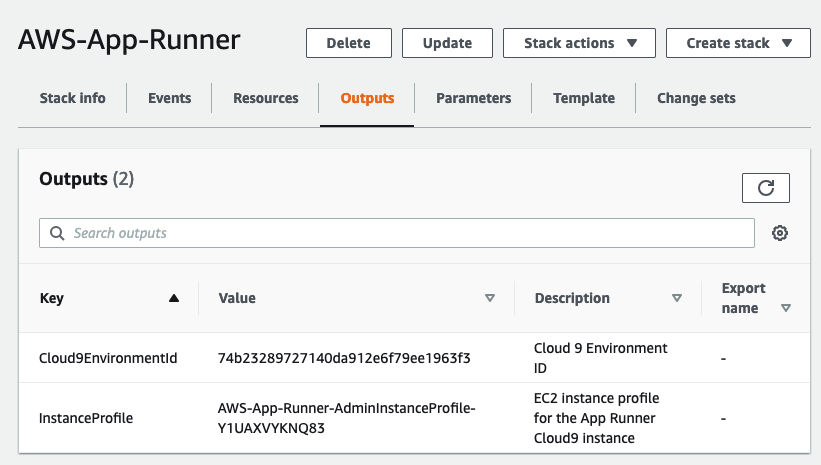

### Step 2 - Assign instance role to Cloud9 instance

1. Launch [AWS EC2 Console](https://console.aws.amazon.com/ec2/v2/home?#Instances).
2. Use stack output value of *Cloud9EnvironmentId* as filter to find the Cloud9 instance.

  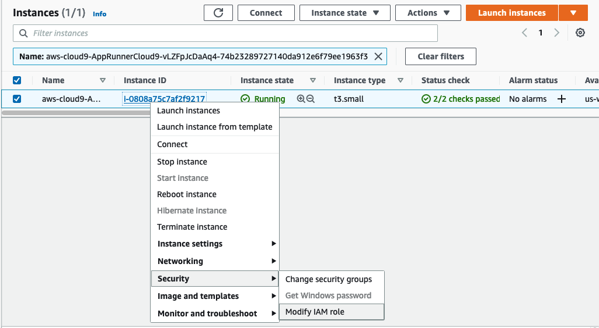

3. Right click the instance, *Security* -> *Modify IAM Role*.
4. Choose the profile name matches to the *InstanceProfile* value from the stack output, and click *Apply*.

  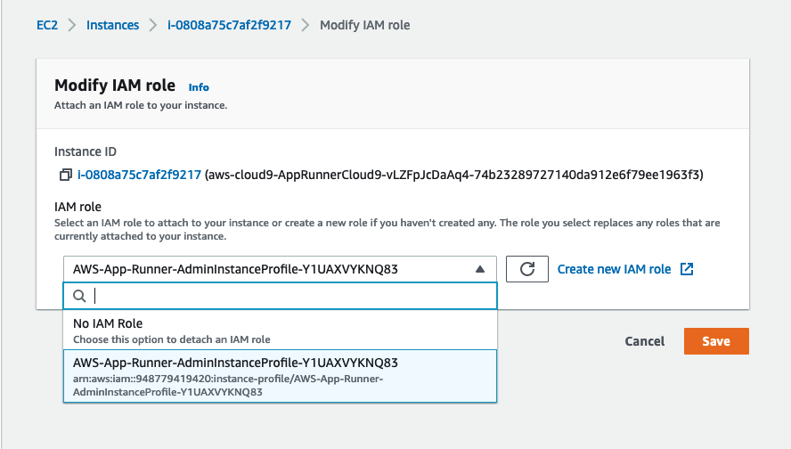

### Step 3 - Disable Cloud9 Managed Credentials

1. Launch [AWS Cloud9 Console](https://console.aws.amazon.com/cloud9/)
1. Locate the Cloud9 environment created for this lab and click "Open IDE". The environment title should start with *AppRunnerCloud9*.
1. At top menu of Cloud9 IDE, click *AWS Cloud9* and choose *Preferences*.
1. At left menu *AWS SETTINGS*, click *Credentials*.
1. Disable AWS managed temporary credentials:

  

### Step 4 - Prepare lab environment on Cloud9 IDE

Run commands below on Cloud9 Terminal to clone this lab repository:

```
git clone https://github.com/phonghuule/aws-app-runner.git
```
### Step 5 - Configure AWS Cli
Run commands below on Cloud9 Terminal to configure the settings that AWS Cli will use to interact with AWS:
```
aws configure
```
Provide inputs as follows:
```
AWS Access Key ID [None]: 
AWS Secret Access Key [None]: 
Default region name [us-west-2]: us-west-2
Default output format [≈]:
```

## Lab

### Create ECR Repository
Our first step will be to create a repository in ECR, this is where we later will store our container image once it’s been built.

Use the following command:
```
aws ecr create-repository --repository-name hello-app-runner
```
We are interested in using the repositoryUri later, so that we can tag and push images to the repository, let’s go ahead and store that as an environment variable for easy access later on.

```
export ECR_REPOSITORY_URI=$(aws ecr describe-repositories --repository-names hello-app-runner --query 'repositories[?repositoryName==`hello-app-runner`].repositoryUri' --output text)
echo $ECR_REPOSITORY_URI
```
Expected Output:
```
948779419420.dkr.ecr.us-west-2.amazonaws.com/hello-app-runner
```
Note down the ECR_REPOSITORY_URI

### Building The Image
It’s time to build our image, but before we can do that, we need to retrieve login credentials for our local container engine, so that we can push the image
```
export AWS_ACCOUNT_ID=$(aws sts get-caller-identity --query 'Account' --output text)
export AWS_REGION=us-west-2  # Change this to the region you are using, for example eu-west-1
aws ecr get-login-password --region $AWS_REGION | docker login --username AWS --password-stdin $AWS_ACCOUNT_ID.dkr.ecr.$AWS_REGION.amazonaws.com
```
The Dockerfile contains the instructions for assembling our container image. Ours is relatively straight forward, it contains a basic splash page with links to relevant App Runner content. Let's have a look
```
cd ~/environment/aws-app-runner/hello-app-runner
cat Dockerfile  
```
Let’s go ahead and build our image.

```
cd ~/environment/aws-app-runner/hello-app-runner
docker build -t hello-app-runner:demo .
```
Let's tag the image and push it to ECR:
```
docker tag hello-app-runner:demo $ECR_REPOSITORY_URI:demo
docker push $ECR_REPOSITORY_URI:demo
```
### Configure App Runner ECR Access
Before we create our App Runner service, we need to setup permissions so that App Runner can read from our ECR repository.
Let’s start by creating an IAM role that App Runner will use, and the roles corresponding trust policy.
```
export TP_FILE=$(mktemp)
export ROLE_NAME=AppRunnerWorkshopAccessRole
cat <<EOF | tee $TP_FILE
{
  "Version": "2012-10-17",
  "Statement": [
    {
      "Effect": "Allow",
      "Principal": {
        "Service": "build.apprunner.amazonaws.com"
      },
      "Action": "sts:AssumeRole"
    }
  ]
}
EOF
aws iam create-role --role-name $ROLE_NAME --assume-role-policy-document file://$TP_FILE
rm $TP_FILE
```
Now we need to attach a policy to the IAM role which grants access to ECR. We will be using a managed policy which will grant the appropriate access. Let’s attach the policy to our role:
```
aws iam attach-role-policy --role-name $ROLE_NAME --policy-arn arn:aws:iam::aws:policy/service-role/AWSAppRunnerServicePolicyForECRAccess
```
Now that we have configured our IAM role and policy, let’s go to [App Runner](https://console.aws.amazon.com/apprunner/) and create our service.

### Create App Runner Service
Go to the [AWS App Runner console](https://us-west-2.console.aws.amazon.com/apprunner/) and click Create an App Runner service.

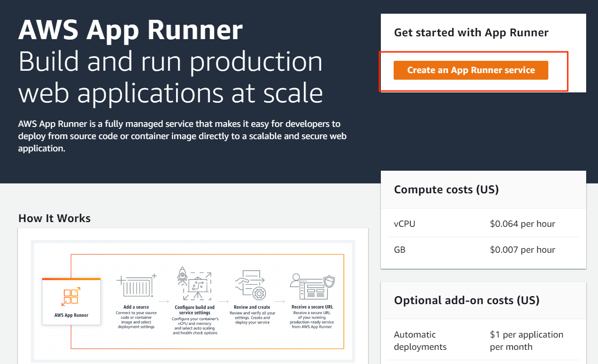

For Repository type, select Container registry, and for Provider, select Amazon ECR, as we will be using the image we have previously built and pushed to our private ECR repository.

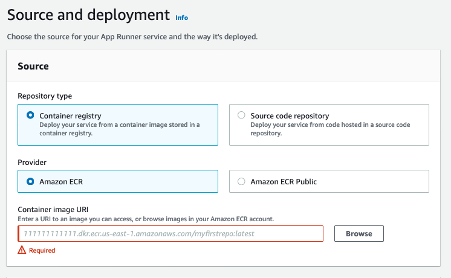

In the Container image URI input, enter the full URI for our image, you can get it by typing the following command in your terminal:

```
echo $ECR_REPOSITORY_URI:demo
```
In the Deployment settings section, select Automatic as the deployment trigger. And for ECR access role, select the role name we’ve previously created

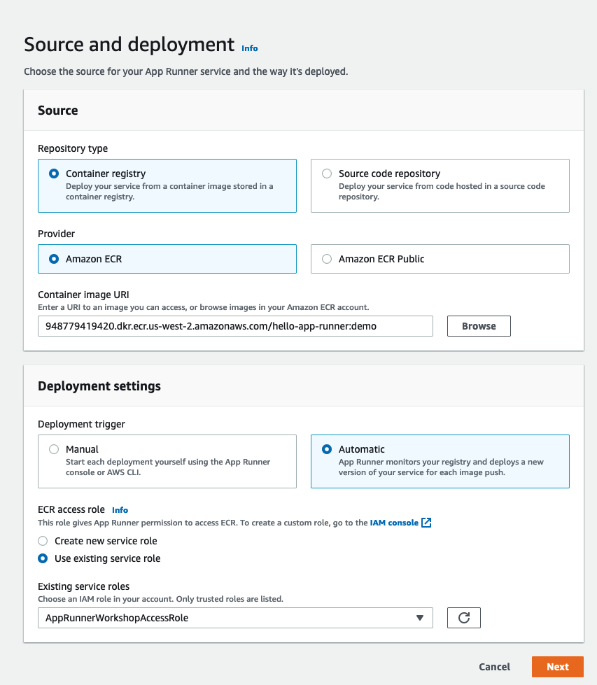

Next, select a name for your service, enter <b>hello-app-runner</b>, and leave the rest with default values

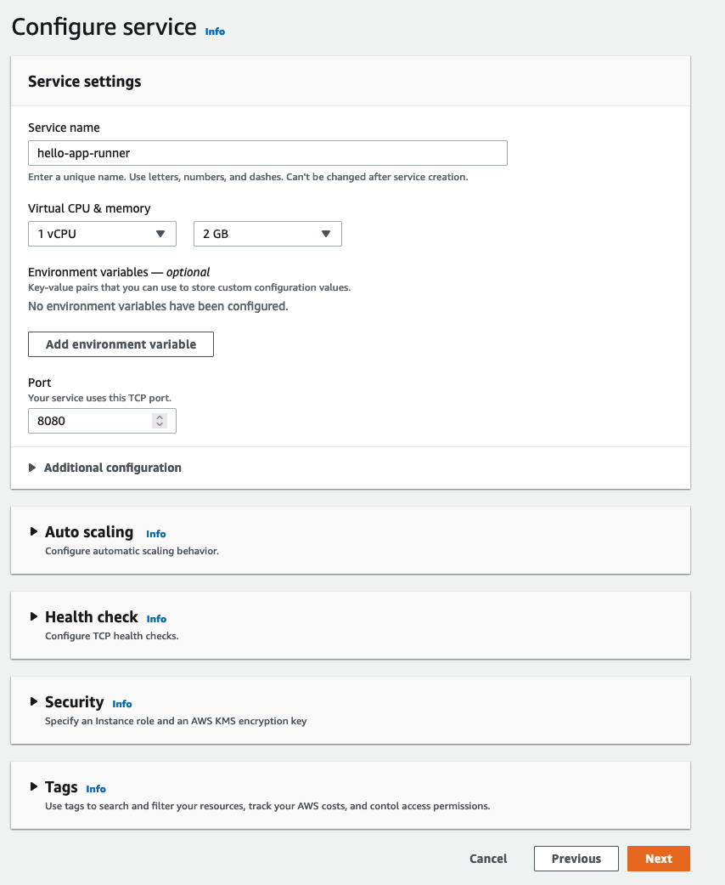

Review our settings, and if everything looks good, click Create & Deploy. 
Your application will be deployed behind a managed load balancer with a TLS certificate. Automatic scaling is based on concurrent requests. Each service also provides CloudWatch metrics and logs for your container. You can focus on building your application while AWS handles the infrastructure.

Once status has moved to “Complete", you can click on the url listed below “Default domain” in order to view the actual web application you have just deployed. 

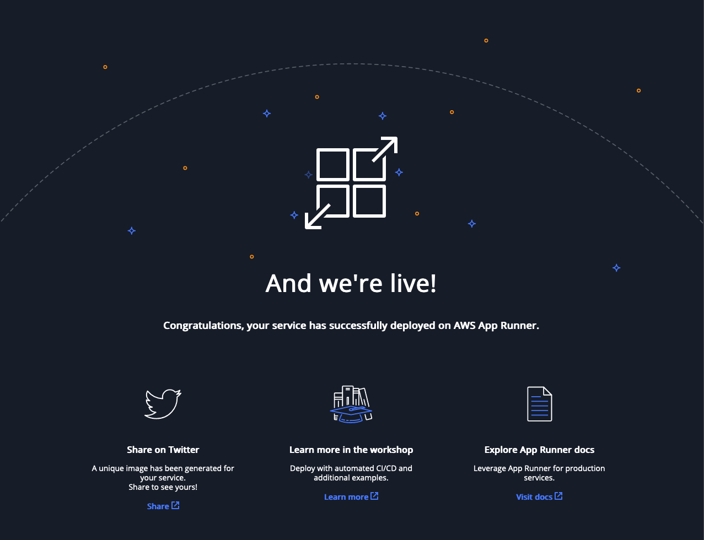

### Automatic Deployment On Code Change

In this section, we will introduce a change to app, build a new version of our container image, and see how AWS App Runner automatically the change, and deploys the new version.

Let’s introduce a change to our code that we will be able to visually inspect.
Open templates/index.html in the Cloud9 editor, and change some text. 

Before:

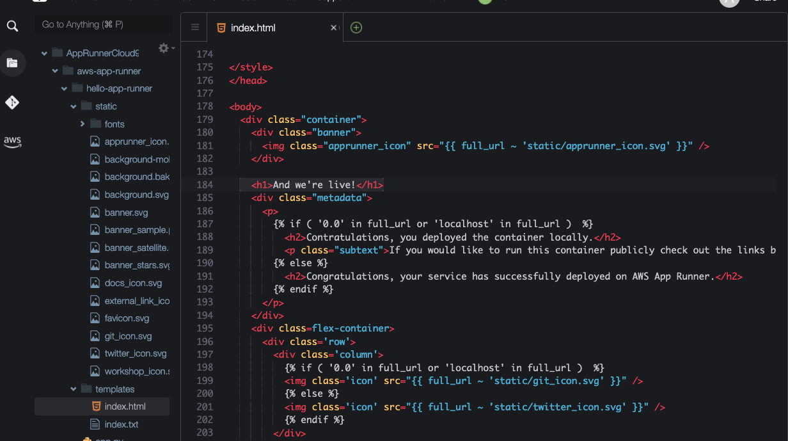

After, added "And we have automatic deployment":

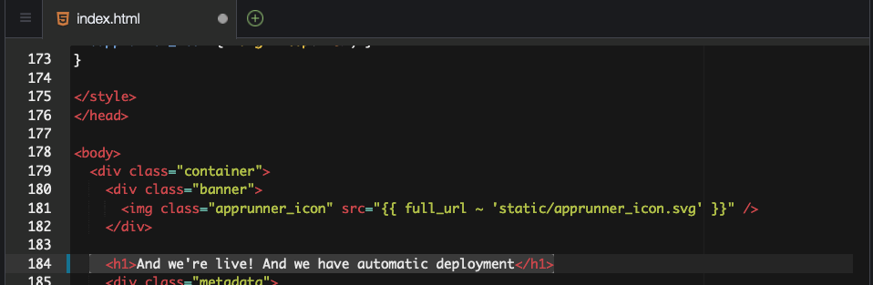

Let’s build a new image with our code changes:

```
cd ~/environment/aws-app-runner/hello-app-runner
docker build -t hello-app-runner:demo .
docker tag hello-app-runner:demo $ECR_REPOSITORY_URI:demo
docker push $ECR_REPOSITORY_URI:demo
```
Our service will now transition into Operation in progress while the deployment occurs, once it is finished, the status will transtion to Running.

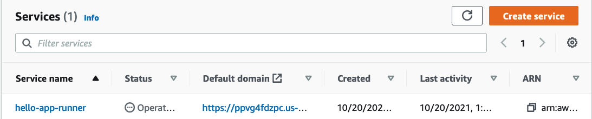

We can then validate that our deployment have succeeded, as we should now see different text when visiting the url

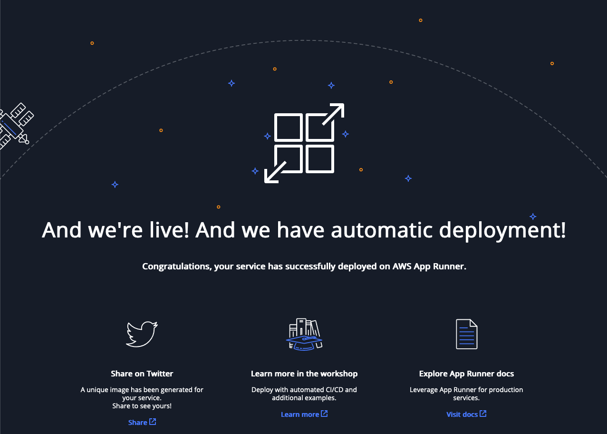

## Clean up
### Step 1
Navigate to [Amazon ECR Console](https://console.aws.amazon.com/ecr/) and delete <b>hello-app-runner</b> repository

### Step 2
Navigate to [AWS App Runner Console](https://console.aws.amazon.com/apprunner/) and delete <b>hello-app-runner</b> service

### Step 3
Delete the Cloud 9 CloudFormation stack named **AWS-App-Runner** from AWS Console:

- Launch [AWS CloudFormation Console](https://console.aws.amazon.com/cloudformation/home)
- Select stack **AWS-App-Runner**.
- In the stack details pane, choose *Delete*.
- Select *Delete* stack when prompted.

## Survey
Let us know what you thought of this session and how we can improve the presentation experience for you in the future by completing this [event session poll](https://amazonmr.au1.qualtrics.com/jfe/form/SV_1U4cxprfqLngWGy?Session=HOL08). Participants who complete the surveys from AWS Innovate Online Conference will receive a gift code for USD25 in AWS credits1, 2 & 3. AWS credits will be sent via email by September 29, 2023.
Note: Only registrants of AWS Innovate Online Conference who complete the surveys will receive a gift code for USD25 in AWS credits via email.

<sup>1</sup>AWS Promotional Credits Terms and conditions apply: https://aws.amazon.com/awscredits/ 
<sup>2</sup>Limited to 1 x USD25 AWS credits per participant.
<sup>3</sup>Participants will be required to provide their business email addresses to receive the gift code for AWS credits.


